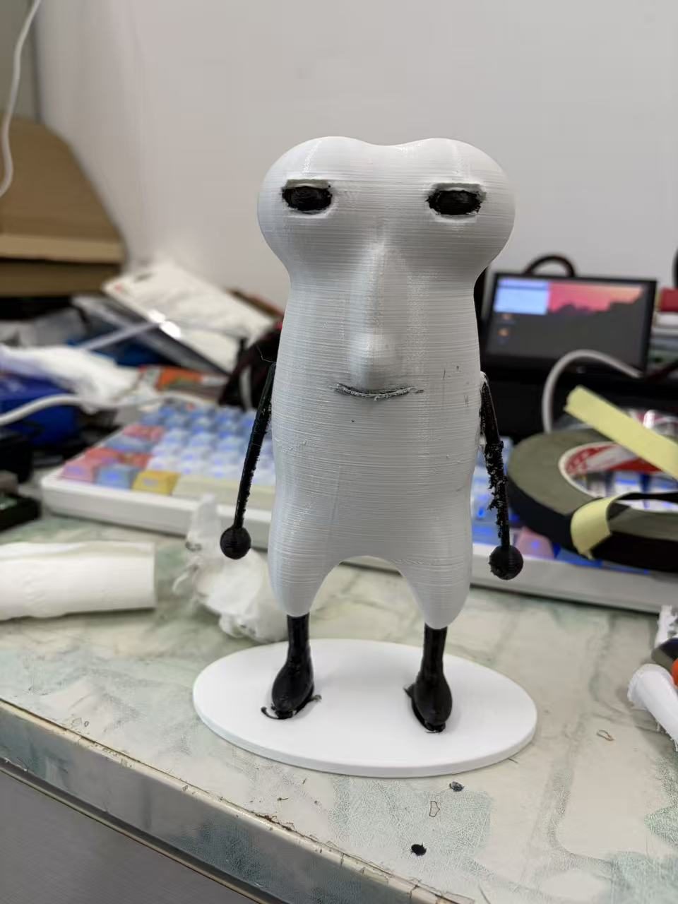

# MyHardFish Gift Edition · 难鱼 3D 打印制作教程

从游戏角色到实体手办：模型 → 切片与 PETG 打印 → 拆支撑、打磨与热熔修复 → 丙烯上色 → 黑色布基胶带修整 → 脚部打黑胶固定。

本次制作参考：约 **128 g PETG**、约 **10 小时打印**。



独立静态网页，包含本次制作的步骤、耗材与用时参考，以及两张实拍照片。无需安装依赖或构建。

## 查看

直接用浏览器打开 `index.html`。如需本地 HTTP 预览，在本目录运行：

```sh
python3 -m http.server 8080
```

然后访问 http://localhost:8080 。

## GitHub Pages

仓库：https://github.com/HardFishDev/MyHardFish-GiftEdition

1. 在仓库 **Settings → Pages → Build and deployment → Source** 中选择 **GitHub Actions**。
2. 在 **Actions** 中运行 `Deploy tutorial to GitHub Pages`，或推送一次到 `main`。
3. 工作流成功后，访问 https://hardfishdev.github.io/MyHardFish-GiftEdition/ 。

已附带 Pages 工作流，无需 npm 安装或构建。网页使用相对路径，支持 GitHub Pages 的仓库子路径。工作流只发布网页、资源、模型和工程，不发布 Git 目录。

也可以使用传统 Pages 分支发布：选择 **Deploy from a branch → main → / (root)**；这时可以停用 Actions 工作流。

本目录包含打印模型、建模工程与源码快照，不依赖游戏站点。约 128 g PETG、约 10 小时仅为本次高精度版本打印记录；轻量版未另行实打验证。没有未经确认的温度、层高、填充或胶水品牌参数。

## 模型与工程

- `models/nanyu-print.stl`：轻量化带底座修复版，毫米单位，约 100 × 58 × 153.5 mm。
- `models/original-models.zip`：未经简化的难鱼原始 STL、高精度修复 STL 和尚未修复的 DBH STL。
- `project/nanyu-editable.blend`：压缩保存的高精度 Blender 工程，网格未简化，包含预览场景。Blender 场景单位已设置为毫米。
- `project/source-code.zip`：当前 `MyHardFish-web` 已提交版本的完整源码快照，不含 Git 历史和 node_modules。
- `project/scripts/`：模型提取、原始网格检查和难鱼修复脚本。
- `project/reports/`：原始提取报告、修复检查报告、轻量版检查报告与源码版本号。
- `project/package-model.py`：本次用于压缩工程与生成轻量模型的脚本；优先使用工作区的原始修复工程，独立使用时读取附带的 `nanyu-editable.blend`。

轻量版经检查为单一连通实体，开放边和非流形边为 0；尚未验证最小壁厚及实际切片结果。原始实打版本保留在 ZIP 中。

### 从源码重新提取

将 `project/source-code.zip` 解压到 `project/`，形成 `project/MyHardFish-web/`，随后运行：

```sh
cd project/MyHardFish-web
npm ci
cd ../scripts
node export-models.mjs
node check-stl.mjs
```

导出的 STL 和报告会生成在 `project/scripts/`。运行难鱼修复脚本时也需要把 `nanyu-raw-150mm.stl` 放在脚本同目录：

```sh
blender --background --factory-startup --python repair-nanyu.py
```

需要 Node.js、项目依赖和 Blender；网页本身不需要这些工具。

## 照片

- `assets/print-with-supports.jpg`：刚打印完成、尚未拆支撑。
- `assets/finished-nanyu.jpg`：完成上色与修整的成品。

网页可使用浏览器的打印功能导出 PDF。修改文案在 `index.html`，修改布局在 `style.css`。

## 开源许可

- 网页代码、工具脚本及本项目原创源码：MIT，见 [LICENSE](LICENSE)。
- 原创教程、制作照片、模型和 Blender 工程：CC BY 4.0，见 [资产许可](ASSET_LICENSE.md)。
- 源码快照内的第三方素材保持原许可，见 [第三方声明](THIRD_PARTY_NOTICES.txt)。

参与改进请阅读 [CONTRIBUTING.md](CONTRIBUTING.md)。
